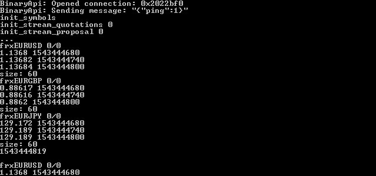
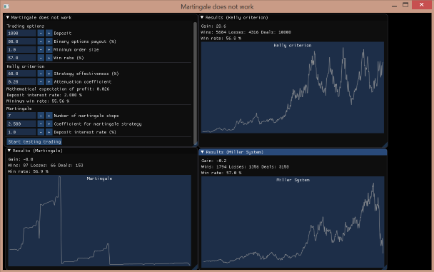

***

### Описание

Данная *header-only* библиотека содержит класс для взаимодействия с Binary.com WebSocket API v3. [https://developers.binary.com/api/](https://developers.binary.com/api/). 

На данный момент библиотека находится в разработке

### Как пользоваться?

Чтобы начать использовать BinaryAPI в своей программе, необходимо после подключения всех зависимостей в проект просто добавить заголовочный файл *BinaryAPI.hpp*. Также для использования дополнительных возможностей, упрощающих использование API, можно добавить в проект файлы с окончанием *Easy.hpp* 

* *BinaryAPI.hpp* содержит класс для взаимодействия с брокером Binary
* *BinaryApiEasy.hpp* содержит функции для загрузки, записи, чтения файлов котировок.
* *ZstdEasy.hpp* позволяет легко использовать библиотеку *zstd* для сжатия и декомпресии файлов котировок.
* *CorrelationEasy.hpp* содержит функции для определения корреляции
* *IndicatorsEasy.hpp* содержит индикаторы технического анализа
* *HistoricalDataEasy.hpp* содержит класс для удобного использования исторических данных
* *NormalizationEasy.hpp* содержит функции для нормализации данных
* *BinaryOptionsEasy.hpp* содержит функции и классы для проведения тестов стратегий (имитация торговли)
* *WavEasy.hpp* позволяет преобразовать котировки в звук
* *FannEasy.hpp* местами облегчает использовать библиотеку FANN

### Пример программы

Программа, которая выводит на экран цены закрытия (последние три минутные свечи) с трех валютных пар (EURUSD, EURGBP, EURJPY), а также время сервера:
```C++
#include "BinaryAPI.hpp"

int main() {
        BinaryAPI iBinaryApi; // класс для взаимодействия с BinaryApi
        
        std::vector<std::string> symbols; // массив валютных пар
        symbols.push_back("frxEURUSD");
        symbols.push_back("frxEURGBP");
        symbols.push_back("frxEURJPY");
        // инициализируем список валютных пар 
        std::cout << "init_symbols " << std::endl;
        iBinaryApi.init_symbols(symbols);
        // инициализируем поток котировок, глубина начальной истории 60 минут
        std::cout << "init_stream_quotations " << iBinaryApi.init_stream_quotations(60) << std::endl;
        // инициализируем поток процентов выплат
        std::cout << "init_stream_proposal " << iBinaryApi.init_stream_proposal(10, 3, iBinaryApi.MINUTES, "USD") << std::endl;
        // последнее полученное с сервера время
        unsigned long long servertime_last = 0;
        // начинается основной цикл программы
        std::cout << "..." << std::endl;
        while(true) {
                // для всех валютных пар
                std::vector<std::vector<double>> close_data; // цены закрытия
                std::vector<std::vector<unsigned long long>> time_data; // время открытия свечей
                std::vector<double> buy_data; // проценты выплат (ставка вверх)
                std::vector<double> sell_data; // проценты выплат (ставка вниз)
                unsigned long long servertime = 0; // время сервера

                if(iBinaryApi.get_servertime(servertime) != iBinaryApi.OK) {
                        // если время сервера не удалось получить
                        iBinaryApi.request_servertime(); // отправляем запрос на получение времени
                        std::this_thread::sleep_for(std::chrono::milliseconds(100)); // задержка 
                        continue;
                } else {
                        // время было получено, проверим, прошла ли секунда
                        if(servertime > servertime_last) {
                                // секунда прошла, сохраним последнее полученное от сервера время
                                servertime_last = servertime;
                        } else {
                                std::this_thread::sleep_for(std::chrono::milliseconds(100));
                                // секунда еще не прошла, вернемся
                                continue;
                        }
                }
                // проверим, удалось ли получить данные по котировкам и процентам выплат
                if(iBinaryApi.get_stream_quotations(close_data, time_data) == iBinaryApi.OK &&
                   iBinaryApi.get_stream_proposal(buy_data, sell_data) == iBinaryApi.OK) {
                        // выводим последние значения котировок валютных пар
                        for(size_t i = 0; i < symbols.size(); ++i) {
                                std::cout << symbols[i] << " " << buy_data[i] << "/" << sell_data[i] << std::endl;
                                for(size_t j = time_data[i].size() - 3; j < time_data[i].size(); ++j) {
                                        std::cout << close_data[i][j] << " " << time_data[i][j] << std::endl;
                                }
                                std::cout << "size: " << time_data[i].size() << std::endl;
                        }
                }
                // время сервера в GMT\UTC
                std::cout << servertime << std::endl;
                std::cout << std::endl;
                std::this_thread::yield();
        }
}
```



### Методы класса BinaryAPI

* Объявление класса BinaryAPI

```C++
#include "BinaryAPI.hpp"

//...

BinaryAPI apiBinary; // откроем соединение с сервером без авторизации
/* Вариант с авторизацией выглядит так:
 * std::string token = "ваш токен", app_id = "id вашего номера приложения"
 * BinaryAPI apiBinary(token, app_id);
 */

```

* Включить логирование ошибок

```C++

apiBinary.set_use_log(true);

```

Все сообщения с ошибками будут записываться в файл, имя которого задано макросом BINARY_API_LOG_FILE_NAME в файле *BinaryAPI.hpp*  
Пример сообщений из файла:

```

//------------------------------------------------------------------------------
start of error message (04.12.2018 18:30:02):
{"echo_req":{"end":1544054400,"granularity":60,"start":1544080800,"style":"candles","ticks_history":"frxEURUSD"},"error":{"code":"InvalidStartEnd","message":"Start time 1544080800 must be before end time 1544054400"},"msg_type":"ticks_history"}
end of error message
//------------------------------------------------------------------------------

//------------------------------------------------------------------------------
start of error message (04.12.2018 18:30:22):
BinaryApi: Error, error message: Операция ввода/вывода была прервана из-за завершения потока команд или по запросу приложения.
end of error message
//------------------------------------------------------------------------------

```

* Инициализировать список валютных пар

Перед тем, как активировать потоки процентов выплат или котировок, необходимо инициализировать список валютных пар

```C++

std::vector<std::string> symbols; // массив валютных пар
symbols.push_back("frxEURUSD");
symbols.push_back("frxEURGBP");
symbols.push_back("frxEURJPY");
// инициализируем список валютных пар 
apiBinary.init_symbols(symbols);

```

* Поток процентов выплат

```C++

if(!apiBinary.is_proposal_stream()) { // если поток процентов выплат еще не был инициализирован
	const double amount = 10.0; // размер ставки,по которой расчитывается процент выплат
    const int duration = 3; // длительность опциона
    const int duration_uint = BinaryAPI::MINUTES; // единица измерения длительности опциона, минуты
    const std::string currency = "USD"; // валюта счета (при авторизации можно не указывать)
	// инициализируем поток процентов выплат
	int err_data = apiBinary.init_stream_proposal(amount, duration, duration_uint, currency);
	if(err_data != apiBinary.OK) { // если не удалось инициализировать поток выплат
		// что нибудь делаем, например попробуем еще раз
	} 
}

// ...

// Допустим у нас без ошибок удалось подключиться к потоку процентов выплат, теперь получим данные

/* массив процентов выплат 
 * номер элемента соответствует позиции в массиве валютных пар
 * Да это тот самый массив валютных пар, который мы указали в методе init_symbols
 * Например, если  frxEURUSD идет первым элементом, значит процент выплат за ставку BUY находится
 * тут buy_data[0];
 */
std::vector<double> buy_data; 
std::vector<double> sell_data;
if(apiBinary.get_stream_proposal(buy_data, sell_data) == apiBinary.OK) { // если мы без ошибок получили проценты выплат
	// Например, выводим последние значения процентов выплат
	for(size_t i = 0; i < symbols.size(); ++i) {
			std::cout << symbols[i] << " " << buy_data[i] << "/" << sell_data[i] << std::endl;
	}
}

// Вдруг мы передумали получать проценты выплат, значит можно (или нужно) остановить поток
apiBinary.stop_stream_proposal();

```

* Поток котировок

```C++

const int LAST_TIME = 60; // количество минут, которые мы предварительно загрузим в массивы с котировками
// инициализируем поток котировок. Изначально в массивах уже будут "исторические" данные за последние 60 минут
apiBinary.init_stream_quotations(LAST_TIME);

// Пьем чай, и вдруг

std::vector<std::vector<double>> close_data; // цены закрытия
std::vector<std::vector<unsigned long long>> time_data; // время открытия свечей
// получаем котировки
if(apiBinary.get_stream_quotations(close_data, time_data) == apiBinary.OK) {
	/* у нас получилось получить массивы котировок без ошибок, делаем с ними что хотим
	 * номер элемента соответствует позиции в массиве валютных пар
	 * в close_data[0] хранится массив котировок для валютной пары frxEURUSD (только в примере!)
	 * соответственно, close_data[0].back() вам вернет последную цену закрытия (или просто текущий тик, если свеча еще не готова)
	 * /
}

// Дальше мы разлили чай, пошли эти котировки...

apiBinary.stop_stream_quotations(); // останавливаем поток котировок

/* не забываем, что и здесь у нас есть метод is_quotations_stream() 
 * с помощью которого мы можем узнать, подписаны мы сейчас на котировки или нет
 */

```

* Поток баланса депозита

```C++

/* подпишемся на поток баланса депозита
 * каждый раз, когда депозит изменяет нам свое значение, сливает наши бабки
 * мы получим его размер на данный момент времени
 */
if(apiBinary.init_stream_balance() != apiBinary.OK) {
	// тут мы окажемся, если произошла ошибочка
}

double balance; // тут будет наш баланс
if(apiBinary.get_balance(balance) != apiBinary.OK) {
	/* тут мы окажемся, если произошла ошибочка, например мы не смогли 
	 * авторизироваться
	 */
}

// а еще есть метод get_currency, при помощи которого мы можем узнать валюту счета

// отпишемся от потока баланса
apiBinary.stop_stream_balance();

```

* Получить время сервера

```C++

unsigned long long server_time;
// пытаемся получить время сервера
if(apiBinary.get_servertime(server_time) != apiBinary.OK) { 
	// тут мы окажемся, если у нас не удалося получить время сервера
	
	// попробуем что ли тогда отправить запрос на получение времени сервера
	apiBinary.request_servertime();
}

//...

```

* Открытие ордера BUY или SELL

```C++

double amount = 1000.0; // поставим 1000 USD, яж человек не жадный!
int duration = 3; // опцион на при минуты!
// откроем ордер BUY!
apiBinary.send_order("frxEURUSD", amount, apiBinary.BUY, duration, apiBinary.MINUTES);

// откроем ордер SELL! У нас же вилка!
apiBinary.send_order("frxEURUSD", amount, apiBinary.SELL, duration, apiBinary.MINUTES);

// дальше ждем, когда сольется депозит

```

* Загрузка исторических данных

```C++

// найдем timestamp даты, с которой мы хотим начать загружать историю в виде минутных баров/свечей
unsigned long long t1 = xtime::get_unix_timestamp(5,11,2018,0,0,0);
unsigned long long t2 = t1 + xtime::SEC_DAY * 30; // загрузим данные за 30 дней!

std::vector<double> candles_close;
std::vector<unsigned long long> candles_times;
// загружаем данные без лимитов
int err = apiBinary.get_candles_without_limits("frxEURUSD", candles_close, candles_times, t1 + 30, t2);

/* если err == 0, значит все хорошо
 * вектор candles_close содержит цены закрытия свечей
 * а вектор candles_times - время открытия свечей
 * ясно понятно?!
 */

std::vector<double> prices;
std::vector<unsigned long long> times;
// аналогичный метод для тиков
apiBinary.get_ticks_without_limits("frxEURUSD", prices, times, t1, t2)

// ...

```

* Возможные состояния ошибок

```C++

// варианты ошибок API
enum ErrorType {
	OK = 0, 					// процесс завершился удачно
	NO_AUTHORIZATION = -1, 		// нет авторизации
	NO_COMMAND = -2, 			// не было команды перед использованием метода
	UNKNOWN_ERROR = -3, 		// неизвестная ошибка
	NO_INIT = -4, 				// не было инициализации перед использованием метода
	NO_OPEN_CONNECTION = -5, 	// нет соединения с сервером
	INVALID_PARAMETER = -6, 	// какой-то параметр указали неверно
	DATA_NOT_AVAILABLE = -7, 	// нет данных, надо жэ...
};

```

### Функции для работы с файлами

* Загрузить данные за последние пару дней

```C++

#include "BinaryApiEasy.hpp"

//...

BinaryAPI iBinaryApi; // класс для взаимодействия с BinaryApi

std::string symbol = "frxEURUSD";
unsigned long long timestamp = 12345678910; // день, с которого начнется загрузка
std::vector<std::vector<double>> prices; // цены (за N дней)
std::vector<std::vector<unsigned long long>> times; // временные метки (за N дней)
int num_days = 5; // количество последних дней
bool is_skip_day_off = true; // пропускать выходные дни
int type = BinaryApiEasy::QUOTES_BARS;

/* Данная функция загружает полные данные за день за последние N дней
 * Важно: При этом текущий день не учавствует в загрузке! Это значит,
 * например, что загружая данные 5 числа в 12 часов дня по GMT за последние 3 дня,
 * данная функция загрузит 4, 3, 2 дни месяца. Котировок из 5-го числа присутствовать в данных не будет!
 */
int err = BinaryApiEasy::download_last_few_days(iBinaryApi, symbol, timestamp, prices, times, num_days, is_skip_day_off, type);
if(err == BinaryApiEasy:OK) {
	// загрузка завершилась удачно
}

```

* Получить имя файла из даты

```C++

unsigned long long timestamp = 12345678910;
/* Выбрана последовательность ГОД МЕСЯЦ ДЕНЬ чтобы файлы были
 * в алфавитном порядке
 * file_name будет содержать имя файла без расширения!
 */
std::string file_name = BinaryApiEasy::get_file_name_from_date(timestamp);

```

* Записать бинарный файл котировок

```C++

std::vector<double> prices;
std::vector<unsigned long long> times;
// Заполним prices и times ...

std::string file_name = "2015_6_6.hex";
// Записать бинарный файл котировок
int err = BinaryApiEasy::write_binary_quotes_file(file_name, prices, times);

```

* Читать бинарный файл котировок

```C++

std::vector<double> prices;
std::vector<unsigned long long> times;

std::string file_name = "2015_6_6.hex";
// Читать бинарный файл котировок
int err = BinaryApiEasy::read_binary_quotes_file(file_name, prices, times);

```

### Функции для работы с алгоритмом сжатия без потерь zstd

* Создание словаря для алгоритма компресии и декомпресии

```C++

#include "ZstdEasy.hpp"

//...

std::string path = "..//..//train"; // путь к папке с примерами обучения
std::string dictionary_file = "quotes_ticks.zstd"; // имя файла словаря
size_t dictionary_size = 100 * 1024; // размер словаря

/* Количество сэмплов (фацлов) для обучения дожно быть примерно 1000 шт и более
 * Как правило, разумный словарь имеет размер ~ 100 КБ.
 * Рекомендуется предоставить несколько тысяч образцов, хотя это может сильно отличаться
 * Рекомендуется, чтобы общий размер всех выборок был примерно в x100 раз больше целевого размера словаря
 */

// начинаем обучение
int err = ZstdEasy::train_zstd(path, dictionary_file, 1024 * 1024);
std::cout << "stop train " << err << std::endl;

```

* Компрессия или декомпрессия файлов

```C++

std::string file_name = "..//..//train//frxEURGBP//2015_12_14.hex"; // имя файла, который надо сжать
std::string compress_file_name = "compress_2015_12_14.hex"; // имя сжатого файла
std::string dictionary_file = "quotes_ticks.zstd"; // имя файла словаря

// сжимаем файл file_name, получаем файл compress_file_name
ZstdEasy::compress_file(file_name, compress_file_name, dictionary_file);

std::string decompress_file_name = "decompress_2015_12_14.hex"; // имя файла после декомпресии

// декомпрессия файла compress_file_name, получаем на выходе файл decompress_file_name
ZstdEasy::decompress_file(compress_file_name, decompress_file_name, dictionary_file);

```

* Чтение или запись сжатых файлов

```C++
std::vector<double> prices;
std::vector<unsigned long long> times;

// заполним prices и times данными
//...

std::string dictionary_file = "quotes_ticks.zstd"; // имя файла словаря

// запишем данные в сжатый файл
ZstdEasy::write_binary_quotes_compressed_file("compress.zstd", dictionary_file, prices, times);
// прочитаем сжатый файл
ZstdEasy::read_binary_quotes_compress_file("compress.zstd", dictionary_file, prices, times);
std::cout << prices.back() << " " << times.back() << std::endl;

/* Еще есть read_compressed_file и write_compressed_file, которые позволяют записывать и читать любые данные
 */
```

* Скачать и сохранить все доступные данные по котировкам

```

/** \brief Скачать и сохранить все доступыне данные по котировкам
 * \param api Класс BinaryAPI
 * \param symbol валютная пара
 * \param path директория, куда сохраняются данные
 * \param dictionary_file файл словаря для декомпресии
 * \param timestamp временная метка, с которой начинается загрузка данных
 * \param is_skip_day_off флаг пропуска выходных дней, true если надо пропускать выходные
 * \param type тип загружаемых данных, QUOTES_BARS - минутные бары, QUOTES_TICKS - тики (как правило период 1 секунда)
 * \param user_function - функтор (можно указать NULL, если не нужен)
 */
int download_and_save_all_data_with_compression(
   BinaryAPI &api,
   std::string symbol,
   std::string path,
   std::string dictionary_file,
   unsigned long long timestamp,
   bool is_skip_day_off = true,
   int type = QUOTES_BARS,
   void (*user_function)(std::string,
	std::vector<double> &,
	std::vector<unsigned long long> &,
	unsigned long long) = NULL);
			
```


### Готовые программы для ОС Windows

В архиве bin.7z содержится несколько программ.

Программа *binary_recorder.exe* записывает проценты выплат для каждой секунды, а также загружает исторические данные тиков и минутных баров за цельный рабочий день.

Программа *binary_proposal_recorder.exe*, которая записывает каждую секунду проценты выплат с валютных пар (WLDAUD...WLDUSD, AUDCAD, AUDCHF, AUDJPY, AUDNZD, AUDUSD, EURAUD, EURCAD, EURCHF, EURGBP, EURJPY, EURNZD, EURUSD, GBPAUD, GBPCAD, GBPCHF, GBPJPY)
Проценты выплат записываются для сделок PUT и CALL с временем экспирации 3 минуты. Для расчета процента используется ставка 10 USD.
Данные записываются в виде бинарных файлов. Каждый файл соответствует конкретной дате и название файла формируется из даты, когда он был записан (например *proposal_29_11_2018.hex*). Время для каждого сэмпла указано в виде 8 байт timestamp в конце, используется время сервера Binary (GMT).
Максимальное число сэмплов в файле соответствует количеству секунд одного дня. 

Программа *simply_upload_history.exe* загружает исторические данные котировок.

Настройки программы хранятся в JSON файле *settings.json*. Пример содержимого файла:
```java
{
	"disk": "D", // диск, на котором находится программа
	"path": "_repoz//binary_historical_data", // папка (репозиторий git), где будут храниться данные
	"amount": 10.0, // ставка для расчета процентов выплат
	"duration": 3, // время экспирации опциона
	"duration_uint": 2, // единица измерения времени (2 - минуты)
	"currency": "USD", // валюта счета 
	"folder": "proposal_data", // папка, где будут храниться данные процентов выплат
	"git": 1 // использовать git для загрузки данных в репозиторий
}
```

На данный момент данные по процентам выплат будут храниться в репозитории [https://github.com/NewYaroslav/binary_historical_data](https://github.com/NewYaroslav/binary_historical_data). 

Программа *martingale_does_not_work.exe* позволяет сравнить разные варианты мани менеджмента и прийти к выводу, что мартингейл не работает.




### Зависимости

*binary-cpp-api* зависит от следующих внешних библиотек / пакетов

* *Simple-WebSocket-Server (необходимо для BinaryApi)* - [https://gitlab.com/eidheim/Simple-WebSocket-Server](https://gitlab.com/eidheim/Simple-WebSocket-Server)
* *Boost.Asio* или автономный *Asio (необходимо для BinaryApi)* - [http://think-async.com/Asio](http://think-async.com/Asio)
* *Библиотека OpenSSL (необходимо для BinaryApi)* - [http://slproweb.com/products/Win32OpenSSL.html](http://slproweb.com/products/Win32OpenSSL.html)
* *Библиотека JSON (необходимо для BinaryApi)* - [https://github.com/nlohmann/json](https://github.com/nlohmann/json)
* *Библиотека zstd (для работы с сжатыми файлами)* - [https://github.com/facebook/zstd](https://github.com/facebook/zstd)
* *Библиотека xtime (необходимо для BinaryApi и для работы с файлами)* - [https://github.com/NewYaroslav/xtime_cpp.git](https://github.com/NewYaroslav/xtime_cpp.git)
* *Библиотека banana-filesystem-cpp (для работы с файлами)* - [https://github.com/NewYaroslav/banana-filesystem-cpp](https://github.com/NewYaroslav/banana-filesystem-cpp)
* *Библиотека imgui (для программы martingale_does_not_work)* - [https://github.com/ocornut/imgui](https://github.com/ocornut/imgui)
* *Библиотека imgui-sfml (для программы martingale_does_not_work)* - [https://github.com/eliasdaler/imgui-sfml](https://github.com/eliasdaler/imgui-sfml)
* *Библиотека SFML (для программы martingale_does_not_work)* - [https://www.sfml-dev.org/](https://www.sfml-dev.org/)
* *gcc* или *mingw* с поддержкой C++11, например - [https://sourceforge.net/projects/mingw-w64/files/Toolchains%20targetting%20Win64/Personal%20Builds/mingw-builds/7.3.0/threads-posix/seh/x86_64-7.3.0-release-posix-seh-rt_v5-rev0.7z/download](https://sourceforge.net/projects/mingw-w64/files/Toolchains%20targetting%20Win64/Personal%20Builds/mingw-builds/7.3.0/threads-posix/seh/x86_64-7.3.0-release-posix-seh-rt_v5-rev0.7z/download)

Все необходимые библиотеки добавлены, как субмодули, в папку lib. 

### Полезные ссылки

Просмотреть схемы JSON можно здесь - [https://github.com/binary-com/websockets/tree/gh-pages/config/v3](https://github.com/binary-com/websockets/tree/gh-pages/config/v3)

Сайт брокера - [https://www.binary.com/](https://www.binary.com/)


